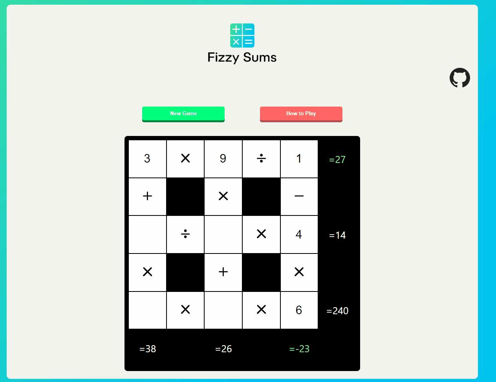

# Fizzy Sums


Check out the latest build at: [fizzysums.com](https://fizzysums.com)

### What is Fizzy Sums?

Fizzy Sums is a basic arithmetic game that plays like a cross between kakuro and sudoku. The goal of the game is 
to satisfy the equations in each row and column such that each number 1 through 9 is used exactly once. You can 
find variations of this game online, but Fizzy Sums follows these guidelines:

- The goal is to satisfy the equations in each row and column using the numbers 1-9 exactly once each
- Order of operations applies - meaning multiplication and division are evaluated before addition and subtraction
- Basic fractions may occur within the equation, but the answer will always be a whole number
- Negative numbers may occur within the equation, and the answer can also be negative

For example:

- 9+8\*5=49 because you evaluate multiplication (8\*5) before addition (9+8). So you get 9+8\*5=9+40=49
- 2/8\*4=1 is valid because even though you get the fraction 1/4 when dividing 2/8, after multiplying by 4 you end 
up with a whole number - only whole numbers occur in the answer
- 3-4\*1=-1 is valid even though a negative number occurs - variations of this game found on the internet may 
not use negative numbers but Fizzy Sums does



### How to install

Make sure you have [git](https://git-scm.com/downloads) and [npm](https://www.npmjs.com/get-npm). Then run the following 
commands from the directory you want to install the project in to clone the repository and install all the needed packages:

```
$ git clone https://github.com/fordchastain/fizzy-sums.git
$ cd fizzy-sums
$ npm install
```

Once it's done installing you can run the project locally with:

```
$ npm start
```

### Why Fizzy Sums?

I made Fizzy Sums as a way to practice creating web applications with React JS. If you are interested, feel free to fork 
the project, make any changes, and submit a pull request. If I feel the change you made improved the project, then I will 
happily merge it into the master branch! I'm still new to React and always looking to improve!